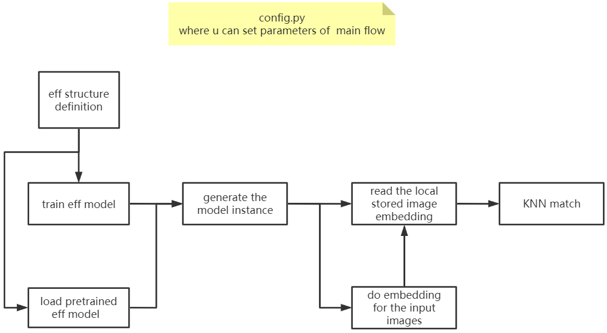

# AI Final Project
Artificial Intelligence Concepts COMP5511_20202_A
Shopee - Price Match Guarantee
https://www.kaggle.com/c/shopee-product-matching

# Group Member
ZHANG Zhenhong  
HUANG Zheming  
ZHOU Hongji  
HUANG Heyang  
ZHANG Jian  

# Introduction
Finding duplicates in large data sets is a problem for many online businesses. Kaggle wants to determine which products have been repeatedly released and analyze project requirements. We know that the core of the problem is that we need to train a model to find images with similar images. What are there? This indicates whether the image is duplicated.  
The techniques used include transfer learning, pre-training models, embedding training, phash, cosine similarity calculation, CNN, KNN, etc. Please check the source code for details.

# Code Structure
Code execution sequence and logic:  
1.Set the random seed of torch.  
2.Load data.  
3.Get the embedding result.   
image part:Get an embedding result, image_embeddings, stored as image_embeddings_tf_efficientnet_b4.csv.  
	3.1.1. Training embedding: Re-use shopee's image data set to train embedding.  
	3.1.2. use the trained embedding.  
text part:Get an embedding result, which is the text_embeddings of the text.  
	3.2. Use shopee's image description text set to train embedding.  
4.Model prediction  
image part:  
	4.1. Use the image after embedding to make KNN, and calculate the nearest top k image sets of a certain image with the help of KNN method.
text part    
	4.2. Use cosine similarity to match text.   
5.Prepare the output result  
submission.cvs, output an image id and the image collection closest to it, representing duplicate images.  
	5.1. Use phash to get the perceptual hash of the image  
	5.2. Use image_predictions, text_predictions, and phash_predictions to do a relationship matching  
	5.3. The relationship set between the output image id and the matched image id  
6.Perform cross_validation  
7.Optimization:  
In order to find the best neighbors, that is, under what threshold the cross_validation score is the highest, an optimization experiment will be carried out.The experiment is divided into three types: text, image, and image cosine calculation.  
  
  
代码执行顺序与逻辑：  
1、设置torch的随机种子.  
2、载入数据.  
3、得到embedding结果.  
image部分：  
得到一个embbedding结果，为image_embeddings，存储为image_embeddings_tf_efficientnet_b4.csv.  
	3.1.1、训练embedding：重新使用shopee的图片数据集训练embedding.  
	3.1.2、利用训练好的embedding.  
text部分：
得到一个embedding结果，为文本的text_embeddings.  
	3.2、使用shopee的图片描述文本集训练embedding.  
4、模型预测  
image部分：  
	4.1、使用embedding后的图形做KNN，借助KNN的方法，计算某一个image最近的top k个image集合.  
text部分：
	4.2、使用余弦相似度来方法进行文本匹配.  
5、准备输出的结果  
submission.cvs，输出一个图像id以及与它最相近的图像集合，表示重复图像.  
	5.1、使用phash得到图像的感知哈希  
	5.2、利用image_predictions、text_predictions、phash_predictions三者做一个关系匹配  
	5.3、输出图像id与匹配到的图像id的关系集合  
6、进行cross_validation  
7、优化:  
为了找到最好的neighbors,即在什么threshold下cross_validation分数最高，将进行优化实验.  
实验分为文本、image、image的cosine计算三种.  

# User Guides
Because the code related files are too large, we store them on the Google cloud disk. Please download them at this link and put them in the corresponding folder
File address:https://drive.google.com/drive/folders/1Bo5QrEdWOvTFKklnI5d99hYdwCWZXISG?usp=sharing
Make sure your shopee data set is placed in shopee-product-matching
Make sure that the embedding result of your shopee's image is placed in shopee-price-match-guarantee-embeddings
Make sure your eff's pre-trained model/finetuned model is placed in model_saved  

由于代码的相关文件体积太大，我们将其存放在google云盘上，请在此链接下载，并放入对应的文件夹中  
文件地址:https://drive.google.com/drive/folders/1Bo5QrEdWOvTFKklnI5d99hYdwCWZXISG?usp=sharing
确保你的shopee数据集放在shopee-product-matching  
确保你的shopee的image的embedding结果放在shopee-price-match-guarantee-embeddings  
确保你的eff的预训练模型/finetuned模型放在model_saved  

# Flow
## Image Embedding

